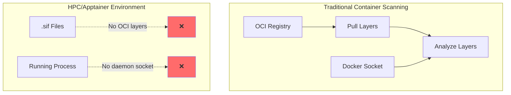
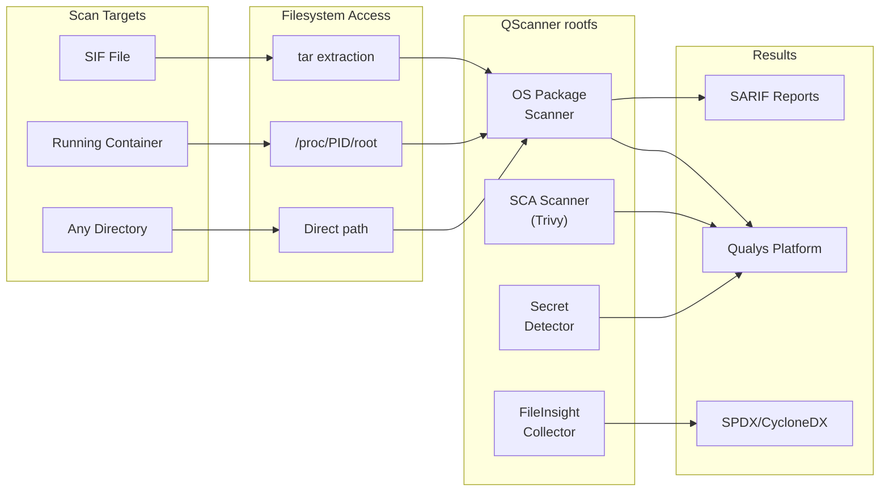
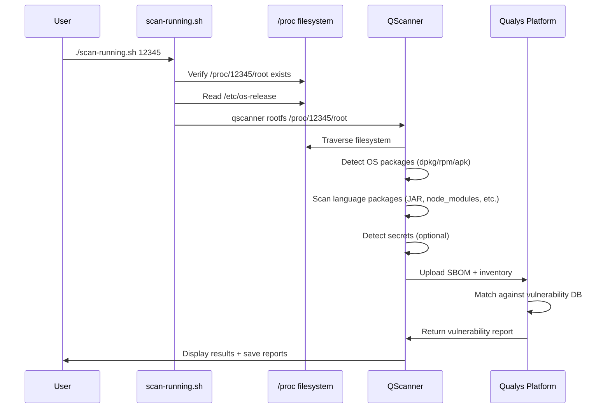
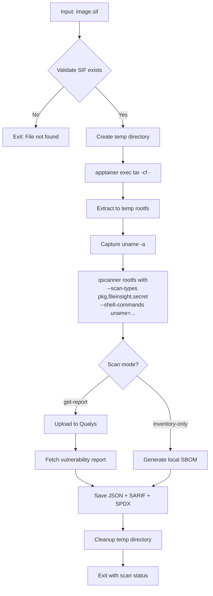
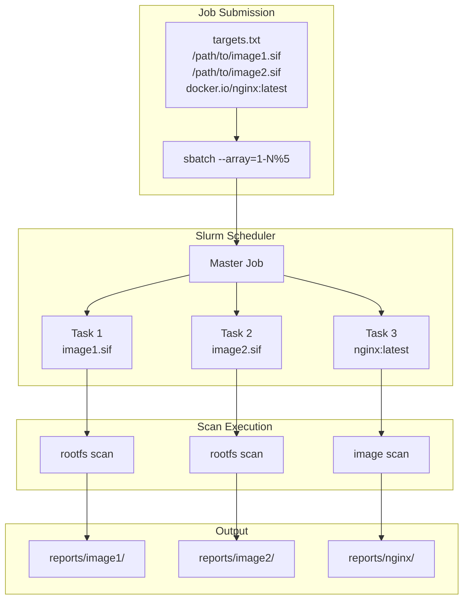

# Vulnerability Scanning for Apptainer Containers with Qualys QScanner

This post details a technical approach for scanning Apptainer (Singularity) container images and running workloads using Qualys QScanner on HPC systems.

## The Problem

Container vulnerability scanning typically requires Docker daemon access or OCI registry connectivity. HPC environments present a different model:

- **No Docker daemon** - Apptainer runs containers as unprivileged user processes
- **SIF format** - Singularity Image Format is a single-file container, not OCI-compliant layers
- **No registry** - Images often exist only as local `.sif` files on shared filesystems
- **Running containers** - No socket API to inspect running workloads



## The Solution: QScanner's rootfs Command

Qualys QScanner embeds [Aqua Trivy](https://github.com/aquasecurity/trivy) as its scanning engine. While the primary interface targets OCI images, the underlying Trivy library supports filesystem scanning. QScanner exposes this via the `rootfs` command:

```bash
qscanner rootfs <filesystem-path>
```

This command analyzes any filesystem tree for:
- OS package vulnerabilities (dpkg, rpm, apk)
- Software Composition Analysis (SCA) for language packages
- Secrets and credential detection
- File metadata collection



## QScanner Architecture

### Scan Types

QScanner's `rootfs` command supports three scan types via `--scan-types`:

| Scan Type | Purpose | What It Detects |
|-----------|---------|-----------------|
| `pkg` | Package vulnerability scanning | OS packages (dpkg, rpm, apk) + language packages |
| `fileinsight` | File metadata collection | Non-package files, configurations, installed software |
| `secret` | Credential detection | API keys, passwords, tokens, private keys |

Default: `--scan-types pkg,fileinsight`

### Scan Modes

The `--mode` flag controls the scanning workflow:

| Mode | Behavior | Use Case |
|------|----------|----------|
| `inventory-only` | Local scan, no backend upload | Air-gapped environments, SBOM generation |
| `scan-only` | Scan and upload to Qualys | Automated pipelines |
| `get-report` | Scan, upload, fetch vulnerability report | Interactive scanning (default) |
| `evaluate-policy` | Scan and evaluate against Qualys policies | Compliance gates |

### SCA Language Support

The `pkg` scan type detects vulnerabilities in language-specific packages:

| Language | Post-Build Artifacts (rootfs) | Files Analyzed |
|----------|------------------------------|----------------|
| **Java** | JAR, WAR, EAR files | Manifest, pom.properties |
| **Python** | Installed packages | egg-info, dist-info, conda-meta |
| **Node.js** | node_modules | package.json |
| **Go** | Compiled binaries | Embedded module info |
| **Rust** | Compiled binaries | cargo-auditable metadata |
| **Ruby** | Installed gems | .gemspec files |
| **.NET** | Assemblies | deps.json, packages.config |
| **PHP** | Composer packages | installed.json |

For `rootfs` targets (post-build), QScanner analyzes installed artifacts rather than lock files—this matches the actual deployed state.

## Implementation Details

### Extracting SIF Filesystems

SIF files contain a SquashFS filesystem. We extract it using Apptainer's `exec` command:

```bash
# Create temporary extraction directory
TEMP_ROOTFS=$(mktemp -d)

# Extract filesystem, excluding virtual mounts
apptainer exec image.sif tar -cf - \
    --exclude=/proc \
    --exclude=/sys \
    --exclude=/dev \
    --exclude=/run \
    / | tar -xf - -C "${TEMP_ROOTFS}"
```

The exclusions prevent tar from attempting to archive virtual filesystems that don't exist in the image.

### OS Identification

QScanner requires OS information to match vulnerabilities against the correct advisory database. The `--shell-commands` parameter provides this context:

```bash
# Capture uname from inside the SIF
UNAME_OUTPUT=$(apptainer exec image.sif uname -a)

# Pass to QScanner for OS detection
qscanner --pod US2 \
    --shell-commands "uname -a=${UNAME_OUTPUT}" \
    rootfs "${TEMP_ROOTFS}"
```

QScanner uses this along with `/etc/os-release` in the filesystem to identify:
- Distribution (Ubuntu, CentOS, Alpine, etc.)
- Version
- Architecture

### Running Container Scanning

Apptainer containers expose their filesystem via procfs:

```bash
# Container PID
PID=12345

# Filesystem is accessible at:
/proc/${PID}/root/

# Scan directly without extraction
qscanner --pod US2 \
    --exclude-dirs /proc,/sys,/dev \
    rootfs /proc/${PID}/root
```

This approach scans the live container state, including any runtime modifications to writable overlay layers.



## Complete Scanning Workflow

### scan-sif.sh Flow



### Example: Full Scan with All Options

```bash
./qscanner \
    --pod US2 \
    --scan-types pkg,fileinsight,secret \
    --shell-commands "uname -a=Linux hpc-node 5.15.0 x86_64" \
    --mode get-report \
    --format json,spdx,cyclonedx \
    --report-format table,sarif,json \
    --detection-priority comprehensive \
    --output-dir ./reports/myimage \
    rootfs /tmp/extracted-sif
```

**Parameters explained:**

| Parameter | Value | Purpose |
|-----------|-------|---------|
| `--pod` | `US2` | Qualys platform endpoint |
| `--scan-types` | `pkg,fileinsight,secret` | Full scan coverage |
| `--shell-commands` | `uname -a=...` | OS identification for vuln matching |
| `--mode` | `get-report` | Scan + fetch vulnerability report |
| `--format` | `json,spdx,cyclonedx` | SBOM output formats |
| `--report-format` | `table,sarif,json` | Vulnerability report formats |
| `--detection-priority` | `comprehensive` | More findings, possible false positives |
| `--output-dir` | `./reports/myimage` | Report destination |

### Output Files Generated

```
reports/myimage/
├── inventory.json          # Raw inventory data
├── inventory.spdx.json     # SPDX 2.3 SBOM
├── inventory.cdx.json      # CycloneDX SBOM
├── report.json             # Detailed vulnerability report
├── report.sarif            # SARIF for CI/CD integration
└── scan.db                 # SQLite database (for Qualys modes)
```

## Slurm HPC Integration

### Single Job Submission

```bash
sbatch --export=ALL,SCAN_TARGET=/shared/containers/app.sif \
    slurm-scan.sh
```

### Batch Scanning with Array Jobs



**targets.txt format:**
```
# SIF files (auto-detected, uses rootfs)
/shared/containers/ubuntu-22.04.sif
/shared/containers/python-ml.sif
/home/user/custom-app.sif

# Registry images (uses image command)
docker.io/library/nginx:1.25
ghcr.io/org/app:latest

# Explicit type prefix
sif:/path/to/file.img
image:quay.io/repo/image:tag
repo:/path/to/source/code
```

## Network and Credential Requirements

### Required Connectivity

| Endpoint | Purpose | Required For |
|----------|---------|--------------|
| `qualysapi.qualys.com` (or regional) | Vulnerability database, result upload | All modes except `inventory-only` |
| `repo.maven.apache.org` | Java dependency resolution | Accurate Java SCA |
| `ghcr.io` | Java database updates | Java vulnerability matching |

### Air-Gapped Operation

For isolated HPC environments:

```bash
# Generate SBOM locally without network
qscanner --mode inventory-only \
    --format spdx,cyclonedx \
    --offline-scan \
    rootfs /path/to/rootfs

# Transfer SBOM to connected system for analysis
scp reports/*.spdx.json analyst@secure-host:/import/
```

### Credential Management

```bash
# Environment variables (add to ~/.bashrc or module file)
export QUALYS_ACCESS_TOKEN="your-token-here"
export QUALYS_POD="US2"

# Or via config file
mkdir -p ~/.config/qualys/qscanner
cat > ~/.config/qualys/qscanner/config.json << EOF
{
  "access_token": "your-token-here",
  "pod": "US2"
}
EOF
chmod 600 ~/.config/qualys/qscanner/config.json
```

## Performance Considerations

### Resource Usage

| Factor | Impact | Mitigation |
|--------|--------|------------|
| SIF extraction | Disk I/O, temp space | Use fast local storage for `TMPDIR` |
| Large images | Memory during scan | `--limit-resource-usage` flag |
| Java scanning | Network for Maven resolution | `--offline-scan` or pre-warm cache |
| Batch jobs | Parallel disk access | Throttle array jobs with `%N` |

### Recommended Slurm Resources

```bash
#SBATCH --mem=4G           # 4GB typically sufficient
#SBATCH --cpus-per-task=2  # Parallel file scanning
#SBATCH --time=00:30:00    # 30 min per image
#SBATCH --tmp=10G          # Local scratch for extraction
```

## Conclusion

QScanner's `rootfs` command enables Qualys vulnerability scanning for Apptainer workloads by:

1. **Extracting SIF filesystems** to a scannable directory tree
2. **Providing OS context** via `--shell-commands` for accurate vulnerability matching
3. **Scanning post-build artifacts** (installed packages, binaries, node_modules) rather than build manifests
4. **Generating standard SBOMs** (SPDX, CycloneDX) for software inventory
5. **Integrating with Slurm** for batch scanning across HPC clusters

This approach requires no modifications to Apptainer itself and works with existing SIF images and running containers. The statically-linked QScanner binary runs on any x86_64 Linux system without dependencies.

---

**Repository:** [qualys-apptainer](https://github.com/your-org/qualys-apptainer)

**Scripts:**
- `scan-sif.sh` - Scan SIF files
- `scan-running.sh` - Scan running containers
- `slurm-batch.sh` - Batch scanning via Slurm array jobs
